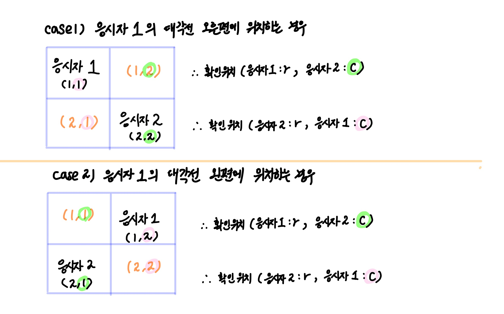

# 2021 채용 연계형 인턴십 - 거리두기 확인하기

> 레벨: 2 <br/>
> Date: 2022년 3월 26일 <br/>

</br>

## 1. 문제 요약

- 시험에 응시하는 응시자들이 거리두기를 지켰는가.
- 각 대기실마다 확인하여 거리두기를 **모두 지켰으면  ⇒ 1**
- 각 대기실마다 확인하여 거리두기를 **한 명이라도 어겼으면 ⇒ 0**

</br>

### 1) 제한 사항

1. 맨해튼 거리 계산: *|r1-r2| + |c1-c2|*
2. 응시자 자리 사이 거리가 2 초과일 때, 거리두기를 지킨 것
3. 거리가 2 이하 일 때, 다음 조건 만족 시에만 거리두기를 지킨 것으로 인정 
    - 응시자 자리 사이, 파티션으로 막혀있다.
    - 단, 대각선일 때는 각 경우마다 거리두기 인정 여부가 다르다

**\* 거리두기 ❌** 
| 응시자1 | ////파티션//// |
|:------:|:-------:|
| XX빈공간XX | 응시자2 |


**\* 거리두기 ⭕**
| 응시자1 | ////파티션//// |
|:------:|:-------:|
| ////파티션//// | 응시자2 |
</br>

### 2) 입력 값

```java
[["POOOP", "OXXOX", "OPXPX", "OOXOX", "POXXP"], 
["POOPX", "OXPXP", "PXXXO", "OXXXO", "OOOPP"], 
["PXOPX", "OXOXP", "OXPOX", "OXXOP", "PXPOX"], 
["OOOXX", "XOOOX", "OOOXX", "OXOOX", "OOOOO"], 
["PXPXP", "XPXPX", "PXPXP", "XPXPX", "PXPXP"]]
```

---
</br>

## 2. 아이디어

- 각 응시자의 위치를 `LinkedList` 에 보관한다.
    
    ∵  모든 응시자 사이의 거리두기 여부를 확인하기 위함
    
    - 거리두기가 2 초과라면 ⇒ 거리두기 ⭕
    - 거리두기가 2 미만이라면 ⇒ 거리두기 ❌
    - 거리두기가 2 일 때, 거리두기가 지켜졌는지 검사 (⭕ | ❌) 

</br>

- `LinkedList` 를 행과 열 기준 **오름차순 정렬**
    
    ∵  응시자 사이 거리두기를 확인할 때
    
    - **가로**로, 일직선 상에서 **오른쪽 방향**으로만 고려
    - **세로**로, 일직선 상에서 **아래 방향**만 고려
    - **대각선** 상에서, 각 응시자의 행을 고정하고, **응시자의 열 위치를 바꿔** 고려
   <br/>
   
  
    

## 3. 코드  


```java
import java.util.*;

public class Solution_2_JHJ {

    public int[] solution(String[][] places) {
        int[] answer = new int[5];
        // 5개의 대기실
        for (int roomNo = 0; roomNo < 5; roomNo++) {
            // 1. 각 대기실 배치
            char[][] map = new char[5][5];
						// 각 응시자의 위치
            LinkedList<Point> pplPoints = new LinkedList<Point>(); 
					
            for (int r = 0; r < 5; r++) {
                String temp = places[roomNo][r];
                for (int c = 0; c < 5; c++) {
                    map[r][c] = temp.charAt(c);
                    if (map[r][c] == 'P') {
                        pplPoints.add(new Point(r, c));
                    }
                }
            }
            Collections.sort(pplPoints);
            // ----------------- input end ------------------------

            // 2. 각 사람들 위치마다 거리두기가 잘 지켜졌는지 확인
            answer[roomNo] = 1;
            for (int i = 0, length = pplPoints.size(); i < length; i++) {
                Point person1 = pplPoints.get(i);
                for (int j = i + 1; j < length; j++) {
                    Point person2 = pplPoints.get(j);
                    int distance = Math.abs(person1.r - person2.r) + Math.abs(person1.c - person2.c);
                    if (distance < 2) {
                        answer[roomNo] = 0;
                        break;
                    } else if (distance == 2 && !isAvailable(map, person1, person2)) {
                        answer[roomNo] = 0;
                        break;
                    }
                }
            }
        }
        return answer;
    }

    // 응시자 사이 거리가 2일 때, 거리두기 여부 확인
    private boolean isAvailable(char[][] map, Point p1, Point p2) {

        int nr = p1.r + 1;
        int nc = p1.c + 1;

        // 각 응시자가 일직선상에 위치할 경우, (가로) 응시자 사이 파티션이 있다면 거리두기를 지킨 것
        if (p1.r == p2.r && map[p1.r][nc] == 'X') return true;

        // 각 응시자가 일직선상에 위치할 경우, 세로) 응시자 사이 파티션이 있다면 거리두기를 지킨 것
        if (p1.c == p2.c && map[nr][p1.c] == 'X') return true;

        // 각 응시자가 대각선으로 위치한 경우, 파티션을 사이에 두고 앉은 경우 거리두기를 지킨 것
        if (map**[p1.r][p2.c]** == 'X' && map**[p2.r][p1.c]** == 'X') return true;

        return false;
    }

    private class Point implements Comparable<Point> {
        int r;
        int c;

        Point(int r, int c) {
            this.r = r;
            this.c = c;
        }

        @Override
        public int compareTo(Point o) {
            if (r == o.r) return c - o.c;
            return r - o.r;
        }
    }
}
```

